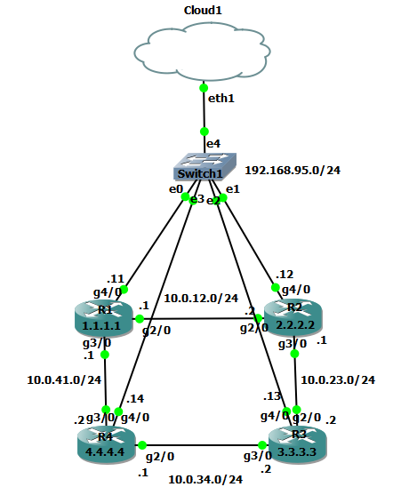

# Network Automation using Python 

## Project Overview
This project demonstrates network automation using Python to configure, validate, and rollback changes on Cisco routers in a GNS3 lab environment.

---

## Lab Setup
- Tool Used: GNS3
- Devices: 4 Routers (R1, R2, R3, R4)
- Topology: Ring topology for redundancy
- Management Network via VMnet8 (Host connectivity)

---

## Project Structure
network-automation-python/
│
├── precheck.py
├── deploy.py
├── postcheck.py
├── validation.py
├── rollback.py
├── comparison.py
│
├── configs/
│     ├── R1_config.txt
│     ├── R2_config.txt
│     ├── R3_config.txt
│     └── R4_config.txt
├── images/
│     └── topology.png
├── inventory/
│     └── devices.yaml
├── templates/
│     └── isis_metric.j2
├── logs/
│     ├── prelogs/
│     └── postlogs/
├── reports/
│ 
│
└── README.md

---

## Network Topology

---

## IP Selection Strategy
The management network was selected based on the host system’s VMnet8 adapter (192.168.95.1), allowing direct SSH connectivity between the automation system and routers without additional NAT or port forwarding.

---

## IP Addressing Scheme

### Management Network
- Network: 192.168.95.0/24
- Purpose: SSH access from host machine

| Device | Interface |  IP Address   |
|--------|-----------|---------------|
| R1     | G4/0      | 192.168.95.11 |
| R2     | G4/0      | 192.168.95.12 |
| R3     | G4/0      | 192.168.95.13 |
| R4     | G4/0      | 192.168.95.14 |

---

### Core Links

| Link       | Network      | Devices(Interface IP) |
|------------|--------------|-----------------------|
| R1 ↔ R2    | 10.0.12.0/24 | 10.0.12.1 / 10.0.12.2 |
| R2 ↔ R3    | 10.0.23.0/24 | 10.0.23.1 / 10.0.23.2 |
| R3 ↔ R4    | 10.0.34.0/24 | 10.0.34.1 / 10.0.34.2 |
| R4 ↔ R1    | 10.0.41.0/24 | 10.0.41.1 / 10.0.41.2 |

---

### Loopbacks
Used for router ID and validation

| Router | Loopback |
|--------|----------|
| R1     | 1.1.1.1  |
| R2     | 2.2.2.2  |
| R3     | 3.3.3.3  |
| R4     | 4.4.4.4  |

---

## Features

- Automated configuration deployment
- Pre & Post validation checks
- Configuration comparison (diff report)
- Rollback alert on failure
- Structured project with modular scripts

---

## Automation Workflow

1. Connect to devices via SSH
2. Take backup of existing configuration
3. Push new configuration
4. Validate:
   - Interface status
   - Routing connectivity (ping loopbacks)
5. If validation fails → alerts rollback
6. Generate diff report

---

## Sample Output

- Config backup stored in `logs/prelogs/pre_sh_run_logs.txt`
- Diff reports stored in `reports/`
- Validation logs (to be enhanced)

---

## Future Improvements

- Add logging system
- Parallel execution using multithreading
- YAML-based device inventory
- Exception handling
- Email alerts on failure

---

## Key Learnings

- Network automation using Python
- Real-world IP planning & topology design
- Validation and rollback strategies
- GitHub project structuring

---
